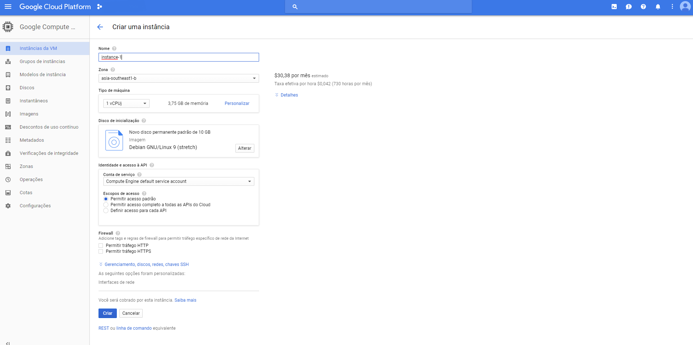
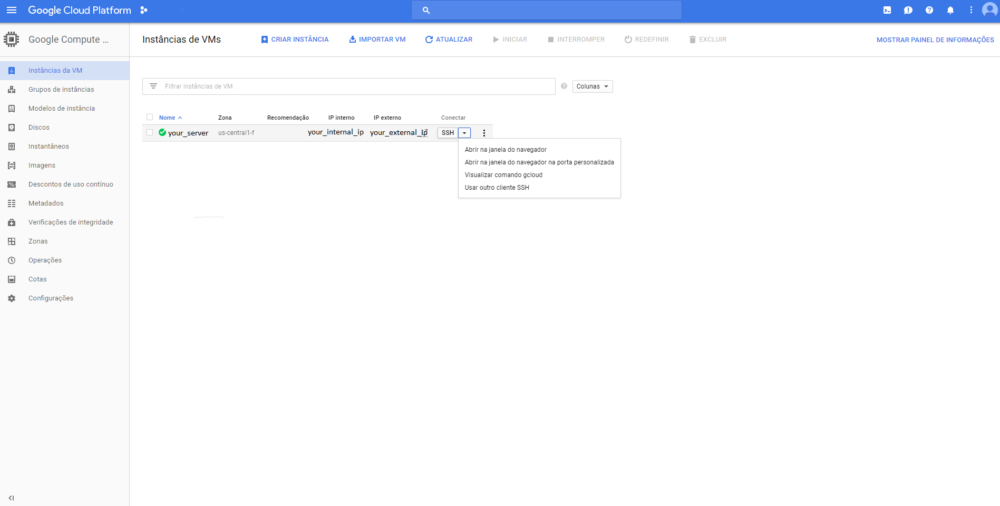
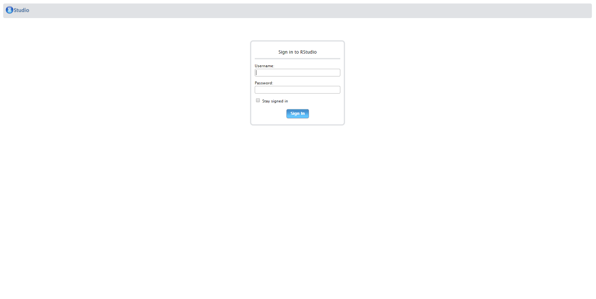
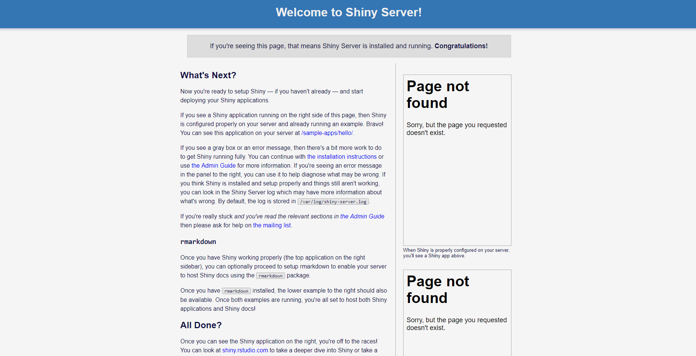

# Google Cloud Platform - How-To deploy Shiny Server and RStudio Server
The ultimate guide to deploy Rstudio Open Source and Shiny Server Open Source at Google Cloud Platform

# Introduction
With the advance of cloud computing, and the more acessibility given to this platforms, there's an uprising trend to use the exisiting cloud services, and integrating it with one of the greatest statistical softwares in the market: R!

This guide is a step-by-step way to show how to configure the Google Cloud Platforms as easy as possible, and how to set up two of the most used features of R in the cloud: RStudio Server - To code wherever you are; and Shiny Server, to deploy amazing data visualization websites without worries.

# Setting up the GCP VM instance
In order to use the google services, you need to signup for the cloud feature, with a valid billing account, even though you receive $300 to use the services for the first time.

After logging in with your google account, and setting up your google cloud console. There are a few steps to take that make the experience of using cloud computing easier. First of all, you'll need a few applications to connect to your server, download the desirable autentications to operate and transfer files from the local machine to your google cloud compute engine.

The applications needed are:
- WinSCP: A file transfer feature that allows transition of files from/to your server easily and safely. (https://winscp.net/eng/download.php)
- Putty: The terminal connection that allows the execution of code inside your virtual machine. (http://www.putty.org/)
- Google Cloud SDK: The google service management that allows the import of private keys to your server, and that helps manage firewall rules. (https://cloud.google.com/sdk/docs/quickstart-windows)

## Creating a VM Instance

Since the installation of the desired software is complete, now you need to create your first VM instance. At the sidepanel of Google Cloud Platform's Console, you'll find the Compute Engine menu, and inside that, the VM Instances Option. Clicking on that you'll be prompted to create or import a Virtual Machine. Select Create, and you'll be taken to the following page:



At this section, you can choose a name for your virtual machine, later you can select where that VM instance will be hosted, the cheaper places are in the us, but given the distance, you might find the connection "laggy". After picking the name and the zone, select what kind of instance you'll be holding. This will be given by your use of technologies, if you'll need lots of memory, or lots of processing cores, here's where you'll choose it. The price per month will depend on this configurations.

After choosing the kind of horsepower that will equip your virtual machine, you can choose what kind of Operational System will come installed with it. For this project, I will choose Ubuntu 14.04, that is one of the most stable versions of Ubuntu server, and lots of applications are supported by it. Also, while choosing the OS, you can choose what kind of storage you'll need. For this project we will choose 30 GBs hosted at an SSD. This gives us speed and reliability.

Later, the last thing to do is allow HTTP traffic and create the VM instance. This process might take a while. If all went correctly you probably will see something like this:


## Setting up VM connections before installing RStudio or Shiny Server

Now, you have a Virtual Machine hosted at Google Cloud Platform! At the external IP that is given to you, you can access different ports into that server, hosted at the cloud. But before we start installing R, Rstudio Server and Shiny Server, we need to create a secure connection between your local machine and the hosted Virtual Machine.

To do that you click on the arrow, at the left of SSH button, as shown below, and select "View gcloud Command":



This step will generate a line of code that will be used to create a secure connection between your local machine, and your server. Do not share this snippet with anyone, since it can be used to connect to your server. Copy this line of code, and paste at the Google SDK app that we downloaded before.

It'll prompt you to authenticate your connection with google, before downloading the private key. After that is done, you'll ve able to find the private key at your Users folder, inside the /.ssh folder. If the authentication went correctly, the gcloud SDK will open a Putty session, running the linux distro that is hosted by the virtual machine, you can close this, since we'll authenticate our connection through WinSCP.

After that is done, you'll open WinSCP, and create a new connection. At the Host you'll insert the EXTERNAL IP ADDRESS that is given by google to your server, the door will remain 22, and the user will be the name of your google account user. After filling this parts, leave the password blank, and click in the Advanced... box, right below the password field. Inside of the Advanced Settings, go to SSH > Authentication at the map to your left. At the field that asks for your Private Key File, you'll click browse, and search for the "google_compute_engine.ppk" file that is stored at your User/.ssh folder.

If this setting went sucessfully, you'll be able to see at the left portion of your screen the files of your local machine, and at the right side of your monitor, the files of you virtual machine. Success, we have managed to enter the files at the google cloud server!

### Allowing ports for Rstudio Server and Shiny Server

Even though we haven't installed yet the RStudio nor the Shiny Server, we can allow the connection ports of the server that will be used later by this applications to connect via browser to our server.

In order to do that, you'll open the GCloud SDK feature, and paste the following codes:
- For the RStudio Connection:
```
sudo gcloud compute firewall-rules create rstudio-conn --allow=tcp:8787
```
- For the Shiny Server Connection:
```
sudo gcloud compute firewall-rules create shiny-conn --allow=tcp:3838
```

Done! Now you'll be able to access the hosted process by RStudio and Shiny Server

# Installing R at your Virtual Machine

Now, we have the configuration, and connection setup, we need to open WinSCP, and open Putty, to use the terminal command line at our virtual machine.

Before installing any applications, make sure that your machine is up-to-date running this commands:
```
sudo apt-get update
sudo apt-get upgrade
```

After it went sucessfully, you'll need to add the R repository to the sources.list file, so that the Ubuntu will know where to fetch the application. The code chunk below adds a line at the repository list, then passes a key for the ubuntu server to download R, updates the existing packages, and installs r-base and r-base dev.
```
sudo sh -c 'echo "deb https://cloud.r-project.org/bin/linux/ubuntu trusty/" >> /etc/apt/sources.list'
sudo apt-key adv --keyserver keyserver.ubuntu.com --recv-keys E084DAB9
sudo apt-get update
sudo apt-get install r-base r-base-dev
```

A few features won't work using only the r-base, since the packages are based on other programs as well, so to cover a few of those, below are the codes used to install the software needed.

1. Spatial Libraries: 
```
sudo apt-get install libgeos-dev libproj-dev libgdal-dev
```
2. Tidyverse Universe: 
```
sudo apt-get install libcurl4-openssl-dev libssl-dev libxml2-dev
```

Now, you can run R at your virtual machine. Since the user logged in does note have root permissions, we advise running R with the following code, so that the instalation of packages will be smoother this way.
```
sudo -i R
```

Now that we have R open at the terminal of our virtual machine, we might as well install a few packages that will be useful with Shiny, such as the shiny package, the RMarkdown package, and dplyr.

To do that, at the command line in R type:
```
install.packages(c('shiny', 'rmarkdown', 'dplyr'))
```

Select the desired mirror, and download the forementioned packages. This process might take a while.

# Installing RStudio Server at your Virtual Machine

Now, we have R installed at our virtual machines, and we need to install the RStudio server in order to access it through the external ip address at door 8787(which is default). To do that, we need to install gdebi first, which is used to install both Shiny Server and Rstudio Server.

The following code will install gdebi, download the .deb file that hosts the RStudio server file, and execute it.
```
sudo apt-get install gdebi-core
wget https://download2.rstudio.org/rstudio-server-1.1.383-i386.deb
sudo gdebi rstudio-server-1.1.383-i386.deb
```

This execution will prompt you to agree with the installation of RStudio server, and if all went well, you'll see that the rstudio-server process is running.

To verify if the installation went correctly, access `http://your_external_ip:8787`. If everything is fine, you'll find this screen:



After this, you'll need to create a user to use the RStudio hosted at your virtual machine, so you go back to the linux terminal, and type: 
```
sudo adduser YOUR_USER_NAME
```

This process will prompt you to create a password and set a few parameters for this new user. But after that you'll be able to use YOUR_USER_NAME and the chosen password to login at RStudio Server. If this process went well, you'll find the RStudio interface at your browser. 

NOTE: Remember, the Rstudio is not running with root permissions, so to install new packages and save files at different folders, you'll need to do that using the linux terminal, with the help of the `sudo` command.

# Installing Shiny Server at your Virtual Machine

The process of installation of the shiny server is pretty similar to the one of the RStudio Server, the difference is the door that the process will be hosted, which by default is 3838, and that the creation of files inside shiny-server is dependent on root permissions, so every modification must be dealt with a `sudo` prefix.

To install the Shiny Server, we'll install the gdebi to execute the installation, if you already have installed gdebi before, you can discard the first line. The second line is to download the file of instalation, and the third one is to execute the installation.

```
sudo apt-get install gdebi-core
wget https://download3.rstudio.org/ubuntu-12.04/x86_64/shiny-server-1.5.5.872-amd64.deb
sudo gdebi shiny-server-1.5.5.872-amd64.deb
```

As well as with the RStudio Server installation, you'll be prompted to agree with the installation. If it all went sucessfully you'll notice a shiny-server process up and running.

To verify if the installation is complete, you can access `http://your_external_ip:3838`. If everything is fine, you'll see this screen:



# Final Remarks

This project is in constant updates and modifications, so you might notice a few changes since the last access, or the last commit. If is there any trouble with any of the installations above, make sure to check the documentation of each feature, to ensure that everything is working fine, and as is supposed to work.

The links below are easy links for the documentation for each of the features revised by this post.

- Google Cloud Compute Documentation (https://cloud.google.com/docs/)
- RStudio Server Documentation (http://docs.rstudio.com/ide/server-pro/)
- Shiny Server Documentation (http://docs.rstudio.com/shiny-server/)

Thanks!
Luis Paese